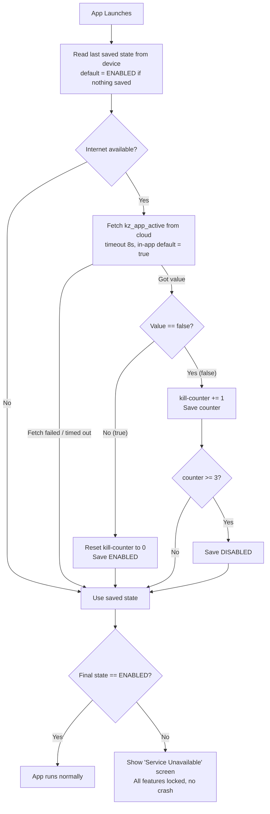

# Kill-Switch & App Protection Plan (KidsZee) — v2

A remote kill-switch that lets **you** disable or re-enable the KidsZee app at any time
from a free web console. Designed for **direct distribution** (APK/IPA installed
manually, **not** via Google Play or the Apple App Store).

> **Design rule above all others: FAIL-OPEN.**
> If *anything* is uncertain — no internet, a timeout, a corrupted value, an exception —
> the app **runs normally**. The app is killed **only** when the server has clearly and
> repeatedly told it to die. This is what prevents accidental bricking.

---

## 0. Why this version is different (and safer)

The first draft had three ways to **accidentally brick the app for real users**. This
version fixes all three:

| Old risk | What went wrong | Fix in v2 |
| :--- | :--- | :--- |
| Signature check bricks everyone | Google Play re-signs your app, so the hash never matched | **You self-sign** (no app store), so the hash is stable. Kept, but **fails open** on any error. |
| Undefined offline/first-launch default | A user with no internet on day 1 could get a dead app | **Default is always ENABLED.** Kill requires a *confirmed* server `false`. |
| Storage read crashes the app | `flutter_secure_storage` throws on some devices/updates | **Every read/write is wrapped in try/catch and fails open.** |

It also adds a **grace counter** (kill only after 2–3 confirmed `false` results) so a single
network glitch can never kill the app, and it **never crashes/exits** — a killed app just
shows a clean maintenance screen.

---

## 1. The Firebase shutdown news — you are safe

Google announced it is shutting down **Firebase Studio** (the browser-based AI coding IDE)
on **March 22, 2027**. This is **NOT** the same as Firebase the platform.

- **Firebase Remote Config** (what this plan uses) is a **core service** and is **explicitly
  not affected**. It keeps running, free, indefinitely.
- Firestore, Authentication, App Hosting — all unaffected too.

**Conclusion:** Building on Firebase Remote Config is safe long-term. No need to change course.

---

## 2. How it works (plain English)

Think of a single light switch in your pocket.

1. You keep a setting in the cloud called `kz_app_active`. Normally it is `true`.
2. The app checks this setting **every time it starts** (and refreshes in the background).
3. To **kill** the app: flip it to `false` in the web console and press Publish.
4. To **revive** the app: flip it back to `true` and press Publish.
5. The last known answer is **remembered on the device**, so the kill sticks even if the
   user goes offline afterward.

### The decision flow



**Key properties**
- **Fail-open:** every red/uncertain path lands on "use saved state", and saved state
  defaults to ENABLED. Nothing accidental can kill it.
- **Soft kill:** needs **3 confirmed `false`** results to actually lock — a single glitch
  can't brick it.
- **Sticky:** once DISABLED is saved, it survives offline until a `true` is fetched again.
- **No crash ever:** locked = a normal screen, never `exit()` or a thrown exception.

---

## 3. What runs on the device (the code pieces)

> Your project today: package `com.kidszee.kidszee`, Flutter + Riverpod + go_router,
> existing files `lib/main.dart` and `lib/core/router/app_router.dart`.
> The app has **no Firebase yet** — these are the additions.

### New files

| File | Job |
| :--- | :--- |
| `lib/core/security/license_service.dart` | The brain. Talks to Remote Config, reads/writes the saved state + kill-counter, runs the signature check, decodes obfuscated strings. Exposes one thing: `bool get isEnabled`. |
| `lib/core/security/license_gate.dart` | A wrapper widget. If `isEnabled == false`, it shows the full-screen maintenance screen instead of the app. |
| `lib/core/security/maintenance_screen.dart` | The friendly "Service temporarily unavailable" screen. No scary text, no crash. |
| `android/app/src/main/kotlin/com/kidszee/kidszee/KidsZeeIntegrity.kt` | (Optional, Android) Reads the APK signing certificate at the OS level and returns its hash to Dart via a MethodChannel. |

### Modified files

| File | Change |
| :--- | :--- |
| `lib/main.dart` | Initialize Firebase + `LicenseService` **before** `runApp()`, then wrap the root app in `LicenseGate`. |
| `lib/core/router/app_router.dart` | Add a redirect guard: if disabled, every route goes to the maintenance screen. (Second, independent check — "scattered" defense.) |
| `pubspec.yaml` | Add the packages below. |
| `android/app/` | Add `google-services.json` and the Google Services Gradle plugin. |
| `ios/Runner/` | Add `GoogleService-Info.plist`. |

### Packages (`pubspec.yaml`)

```yaml
# Kill-switch (all free tier)
firebase_core: ^3.8.0
firebase_remote_config: ^5.3.0
connectivity_plus: ^6.1.0          # is there internet right now?

# You ALREADY have shared_preferences: ^2.2.3 — we use it for the saved state.
# (Plain shared_preferences is chosen over flutter_secure_storage on purpose:
#  far fewer crashes on real devices. The state is low-value, so AES is overkill.)
```

> **Why not `flutter_secure_storage`?** It throws or returns null on some Android OEMs and
> after OS/app updates, which is a brick risk. For a simple on/off flag the security gain is
> tiny and the crash risk is real. If you still want encryption, store an XOR-scrambled
> string in `shared_preferences` instead — same effect, no keystore fragility.

---

## 4. The protection layers (which to keep, which to drop)

Because you self-sign and distribute directly, your real adversary is the **non-technical
client**, not a professional reverse-engineer. So we keep the layers that are free and
zero-risk, and drop the ones that add crash risk for little gain.

| Layer | Keep? | Why |
| :--- | :--- | :--- |
| **1. Flutter ARM compile** | ✅ Keep | Free, automatic. Dart compiles to a native blob (`libapp.so`) that `jadx`/`apktool` can't read. |
| **2. `--obfuscate` build flag** | ✅ Keep | Free. Renames everything to gibberish. Zero crash risk. |
| **3. Encrypted/obfuscated saved state** | ✅ Keep (light) | Use XOR-scrambled value in `shared_preferences`, not `flutter_secure_storage`. |
| **4. Scattered checks** | ✅ Keep | The kill is checked in 2–3 places (LicenseGate widget + router redirect), with different variable names, so deleting one doesn't open the app. |
| **5. APK signature integrity** | ⚠️ Keep, fail-open | **Now viable** because you self-sign (no Play re-signing). If someone strips the kill-switch and re-signs with their own key, the hash mismatches and the app locks. **Must fail open** if the hash can't be read, and **remember**: if *you* ever change your keystore, you must update the stored hash or it self-locks. |
| **6. Native Kotlin kill-check** | ❌ Drop | Doubles the crash surface for marginal benefit against a non-technical client. (Layer 5 already uses native code just to *read* the signature, which is enough.) |
| **7. XOR-encrypted strings** | ✅ Keep | Free. Firebase IDs / flag names XOR-encoded at compile time so `strings libapp.so` reveals nothing. |

> **iOS note for Layer 5:** iOS doesn't have an "APK signature" — it uses provisioning
> profiles / code-signing. The signature check is **Android-only**. On iOS, rely on Layers
> 1, 2, 4, 7 + the Remote Config kill (which works identically on iOS). That's plenty for
> direct distribution.

---

## 5. The golden safety rules (every one of these prevents a brick/crash)

1. **Default ENABLED, always.** If no value is saved yet → ENABLED.
2. **Set an in-app Remote Config default of `kz_app_active = true`** *before* fetching, so a
   failed fetch can never read as `false`.
3. **Wrap every storage and network call in `try/catch`.** On any error → treat as ENABLED.
4. **Require 3 confirmed `false` results** (the kill-counter) before locking. One `true`
   resets the counter to 0.
5. **Fetch timeout = 8 seconds**, then continue regardless. Never block the splash forever.
6. **Locked = a screen, never a crash.** No `exit(0)`, no `throw`. The app must always reach
   a stable UI.
7. **Signature check fails open.** If the hash can't be read for any reason → ENABLED.
8. **Test the kill AND the revive on a real device before shipping** (see §7).

---

## 6. One-time setup (you do this once)

1. Go to the [Firebase Console](https://console.firebase.google.com/) and create a project,
   e.g. `KidsZee-Admin`.
2. **Add an Android app** with package name **`com.kidszee.kidszee`** (your real package —
   the old plan said `com.kidszee.app`, which is wrong). Download `google-services.json`
   into `android/app/`.
3. **Add an iOS app** with your bundle ID (check `ios/Runner.xcodeproj`). Download
   `GoogleService-Info.plist` into `ios/Runner/`.
4. In the console: **Run > Remote Config**. Add a parameter:
   - Name: `kz_app_active`
   - Type: Boolean
   - Default value: `true`
   - Press **Publish changes**.
5. Done. To kill: set it to `false`, Publish. To revive: set to `true`, Publish.
   (Allow a few minutes; the app also has a minimum fetch interval.)

---

## 7. Build & test

### Release build (turns on Layers 1 + 2)
```bash
# Android
flutter build apk --release --obfuscate --split-debug-info=build/debug-info

# iOS
flutter build ipa --release --obfuscate --split-debug-info=build/debug-info
```
> Keep the `build/debug-info` folder — you need it to read crash stack traces later.

### Test checklist (do all of these on a real device before shipping)
- [ ] Fresh install, **no internet** → app runs (fail-open works).
- [ ] Fresh install, **with internet**, `kz_app_active = true` → app runs.
- [ ] Set `false`, Publish, restart app 3× → app locks on the maintenance screen.
- [ ] Now go **offline** and restart → still locked (sticky kill works).
- [ ] Set `true`, Publish, go online, restart → app revives.
- [ ] Airplane mode + corrupt/clear app storage → app still runs (no crash).
- [ ] (Android) Re-sign the APK with a different key → app locks (signature layer works).

---

## 8. Long-term durability

- **Firebase Remote Config** is free, core, and not being discontinued. No expiry, no card
  required for this usage.
- **Your only operational dependency** is keeping the Firebase project alive (don't delete
  it) and not changing your signing keystore without updating the stored hash.
- **If you ever want to drop Firebase entirely:** the exact same design works by fetching a
  tiny JSON file (`{"kz_app_active": true}`) from any free static host (Cloudflare Pages,
  GitHub raw). Only `LicenseService`'s fetch method changes; every safety rule stays the
  same.

---

## 9. Important non-technical note

Using a kill-switch as leverage against a client can have **contractual implications**
(disabling delivered software). Put a clause in your agreement that reserves your right to
remotely disable the app on non-payment, so the leverage is enforceable rather than a
liability. This is a legal matter — confirm the wording with someone qualified.

---

## Summary

- **Firebase is safe** — only Firebase *Studio* is shutting down, not Remote Config.
- **Concept kept, safety hardened:** fail-open everywhere, 3-strike soft kill, no crashes,
  signature check re-enabled because you self-sign.
- **Dropped** the native double-check (Layer 6) and **swapped** `flutter_secure_storage` for
  obfuscated `shared_preferences` to remove the two biggest crash risks.
- **Works on Android and iOS**; signature layer is Android-only, everything else is shared.
